# DB_5786_8100_2119
## אליהו עבודי , אורי מגד

## מערכת מסעדה, מודול שולחנות

## תוכן עניינים

1. [מבוא](#מבוא)
2. [4 מסכים](#4-מסכים)
3. [סכמות מסד נתונים](#סכמות-מסד-נתונים)
4. [מתודולוגיות אכלוס נתונים](#מתודולוגיות-אכלוס-נתונים)
5. [גיבוי ושחזור נתונים](#גיבוי-ושחזור-נתונים)
6. [שלב ב — שאילתות SELECT כפולות (S1–S4)](#שלב-ב--שאילתות-select-כפולות-s1s4)
7. [שלב ב — שאילתות SELECT נוספות (S5–S8)](#שלב-ב--שאילתות-select-נוספות-s5s8)
8. [שלב ב — שאילתות DELETE](#שלב-ב--שאילתות-delete)
9. [שלב ב — שאילתות UPDATE](#שלב-ב--שאילתות-update)
10. [שלב ב — אילוצים (Constraints)](#שלב-ב--אילוצים-constraints)
11. [שלב ב — Rollback ו-Commit](#שלב-ב--rollback-ו-commit)
12. [שלב ב — אינדקסים (Indexes)](#שלב-ב--אינדקסים-indexes)

---

## מבוא

ארכיטקטורת מסד נתונים יחסית (Relational Database) זו מתוכננת לרכז ולנהל את נתוני התפעול הליבתיים של מסעדה מודרנית. המערכת מתעדת נתונים בלתי משתנים אודות זהויות לקוחות, הזמנות סעודה כרונולוגיות, רשימות המתנה דינמיות ללקוחות מזדמנים, משוב סעודה איכותני, ופנקס תגמולי נאמנות מדורג. 

הפונקציונליות המרכזית מבטיחה כי הנהלת המסעדה תוכל לעקוב באופן רציף אחר מחזור החיים של הלקוח — החל מהזמנת שולחן ועד לצבירת נקודות נאמנות מבוססות עסקאות — תוך אכיפה קפדנית של שלמות כרונולוגית ואילוצים מתמטיים למניעת אנומליות בנתונים.

## 4 מסכים

## מסך הזמנות


## מסך רשימת המתנה


## מסך נאמנות


## מסך משוב


## סכמות מסד נתונים

## תרשים ישויות-קשרים (ERD)


## סכמת מסד נתונים (DSD)


## מתודולוגיות אכלוס נתונים

## Mockaroo


## הכנסה ידנית (Manual Insert)


## סקריפט Python


## גיבוי ושחזור נתונים


---

# שלב ב — דוח שאילתות, אילוצים, טרנזקציות ואינדקסים

---

## שלב ב — שאילתות SELECT כפולות (S1–S4)

לכל אחת מ-4 השאילתות הבאות מוצגות שתי צורות כתיבה (Form A ו-Form B), כולל הסבר על ההבדל ביניהן ומה יותר יעיל.

---

### S1 — דוח חודשי של נפח הזמנות

**תיאור:** שאילתא זו מציגה את סך ההזמנות לפי חודש ושנה, כולל גודל קבוצה ממוצע, סך אורחים, ומספר ההזמנות שהושלמו, בוטלו, או סומנו כ-No-Show. השאילתא משמשת את מסך ניהול ההזמנות ולוח הבקרה של ההנהלה לצורך תכנון כוח אדם.

**צורה A — JOIN עם GROUP BY (יעילה יותר):**

```sql
SELECT
    EXTRACT(YEAR FROM r.datetime)   AS reservation_year,
    EXTRACT(MONTH FROM r.datetime)  AS reservation_month,
    COUNT(*)                        AS total_reservations,
    ROUND(AVG(r.party_size), 1)     AS avg_party_size,
    SUM(r.party_size)               AS total_guests,
    COUNT(CASE WHEN st.description = 'Completed' THEN 1 END) AS completed_count,
    COUNT(CASE WHEN st.description = 'Cancelled' THEN 1 END) AS cancelled_count,
    COUNT(CASE WHEN st.description = 'No-Show'   THEN 1 END) AS noshow_count
FROM RESERVATION r
JOIN STATUS_TYPE st ON r.status_ID = st.status_ID
GROUP BY
    EXTRACT(YEAR FROM r.datetime),
    EXTRACT(MONTH FROM r.datetime)
ORDER BY reservation_year DESC, reservation_month DESC;
```

**צילום הרצה:**

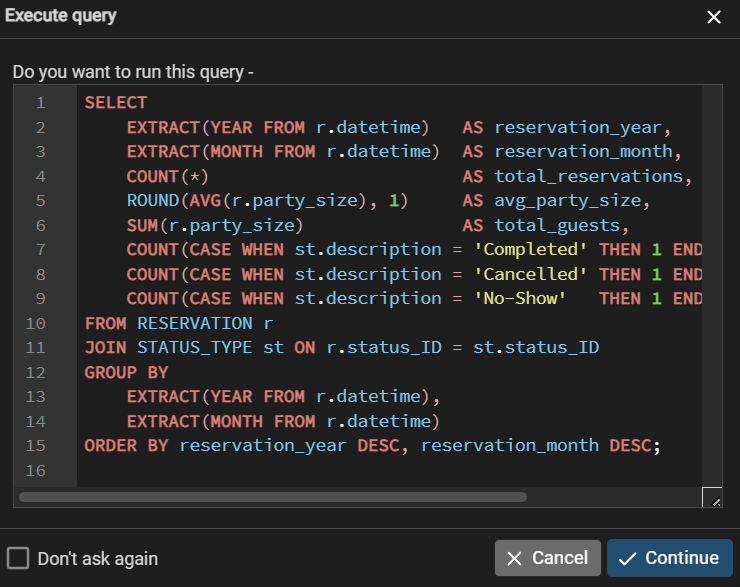

**צילום תוצאה:**

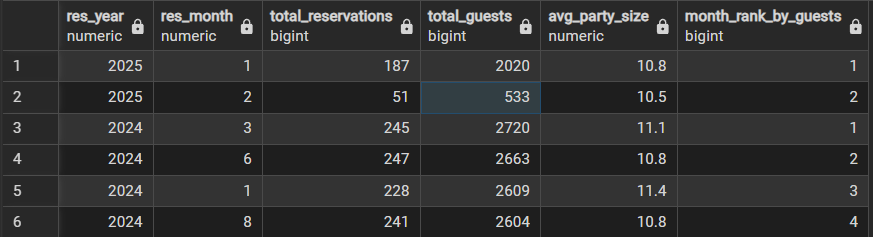

---

**צורה B — שאילתות-משנה מתואמות ב-SELECT (פחות יעילה):**

```sql
SELECT
    r_agg.reservation_year,
    r_agg.reservation_month,
    r_agg.total_reservations,
    r_agg.avg_party_size,
    r_agg.total_guests,
    (SELECT COUNT(*)
     FROM RESERVATION r2
     WHERE r2.status_ID = (SELECT status_ID FROM STATUS_TYPE WHERE description = 'Completed')
       AND EXTRACT(YEAR FROM r2.datetime)  = r_agg.reservation_year
       AND EXTRACT(MONTH FROM r2.datetime) = r_agg.reservation_month
    ) AS completed_count,
    (SELECT COUNT(*)
     FROM RESERVATION r2
     WHERE r2.status_ID = (SELECT status_ID FROM STATUS_TYPE WHERE description = 'Cancelled')
       AND EXTRACT(YEAR FROM r2.datetime)  = r_agg.reservation_year
       AND EXTRACT(MONTH FROM r2.datetime) = r_agg.reservation_month
    ) AS cancelled_count
FROM (
    SELECT
        EXTRACT(YEAR FROM r.datetime)   AS reservation_year,
        EXTRACT(MONTH FROM r.datetime)  AS reservation_month,
        COUNT(*)                        AS total_reservations,
        ROUND(AVG(r.party_size), 1)     AS avg_party_size,
        SUM(r.party_size)               AS total_guests
    FROM RESERVATION r
    GROUP BY
        EXTRACT(YEAR FROM r.datetime),
        EXTRACT(MONTH FROM r.datetime)
) r_agg
ORDER BY reservation_year DESC, reservation_month DESC;
```

**צילום הרצה:**

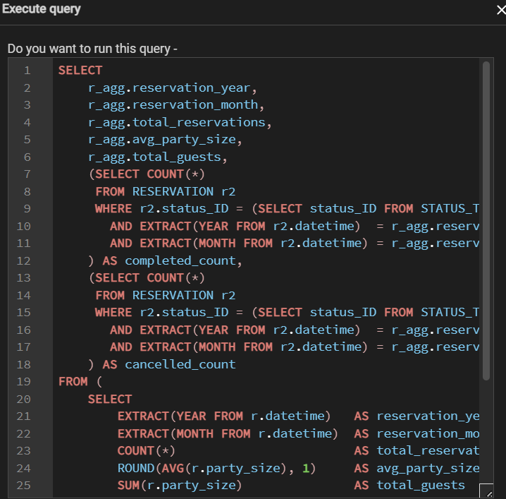

**צילום תוצאה:**

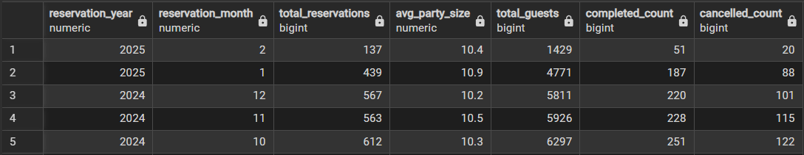

**הבדל ויעילות:**

צורה A מבצעת סריקה אחת של טבלת RESERVATION עם JOIN ל-STATUS_TYPE ומבצעת את כל האגרגציות (COUNT, AVG, SUM) במעבר יחיד. צורה B לעומתה משתמשת בשאילתות-משנה מתואמות (Correlated Subqueries) ב-SELECT — לכל שורת תוצאה (כל חודש/שנה) מתבצעת סריקה נוספת של טבלת RESERVATION. מדובר ב-N סריקות נפרדות לעומת סריקה אחת בצורה A, ולכן **צורה A יעילה יותר** באופן משמעותי, בייחוד עם כמויות נתונים גדולות.

---

### S2 — 10 הלקוחות המובילים לפי הזמנות ונאמנות

**תיאור:** שאילתא זו מזהה את הלקוחות הפעילים ביותר במערכת, כולל מספר ההזמנות שלהם, דירוג ממוצע של המשוב, נקודות נאמנות, ורמה (Tier). השאילתא מפעילה את מסך הנאמנות ואת הברכה האישית ללקוח.

**צורה A — JOIN-based (יעילה יותר):**

```sql
SELECT
    c.Customer_ID,
    c.first_name || ' ' || c.last_name    AS full_name,
    c.email,
    COUNT(DISTINCT r.reservation_ID)       AS total_reservations,
    COALESCE(ROUND(AVG(f.rating), 2), 0)   AS avg_rating,
    l.points                               AS loyalty_points,
    lt.level                               AS loyalty_tier
FROM CUSTOMER c
JOIN RESERVATION r   ON c.Customer_ID = r.Customer_ID
LEFT JOIN FEEDBACK f ON r.reservation_ID = f.reservation_ID
JOIN LOYALTY l       ON c.Customer_ID = l.Customer_ID
JOIN LOYALTY_TIER lt ON l.tier_id = lt.tier_id
WHERE c.is_active = 1
GROUP BY c.Customer_ID, c.first_name, c.last_name, c.email,
         l.points, lt.level
ORDER BY total_reservations DESC, avg_rating DESC
LIMIT 10;
```

**צילום הרצה:**

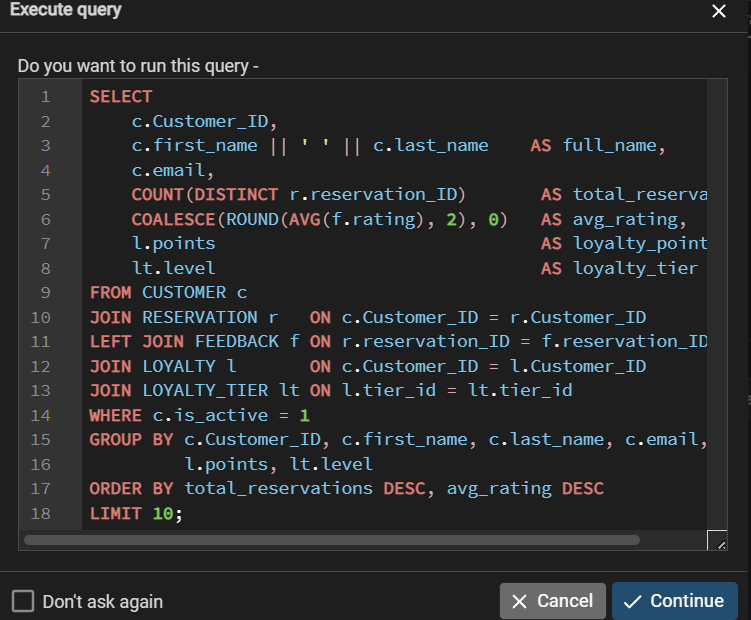

**צילום תוצאה:**

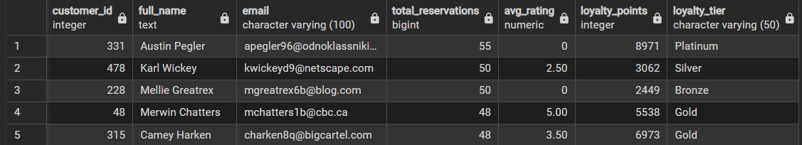

---

**צורה B — שאילתות-משנה מתואמות (פחות יעילה):**

```sql
SELECT
    c.Customer_ID,
    c.first_name || ' ' || c.last_name    AS full_name,
    c.email,
    (SELECT COUNT(*)
     FROM RESERVATION r
     WHERE r.Customer_ID = c.Customer_ID
    ) AS total_reservations,
    COALESCE(
      (SELECT ROUND(AVG(f.rating), 2)
       FROM FEEDBACK f
       JOIN RESERVATION r ON f.reservation_ID = r.reservation_ID
       WHERE r.Customer_ID = c.Customer_ID
      ), 0
    ) AS avg_rating,
    l.points           AS loyalty_points,
    lt.level           AS loyalty_tier
FROM CUSTOMER c
JOIN LOYALTY l       ON c.Customer_ID = l.Customer_ID
JOIN LOYALTY_TIER lt ON l.tier_id = lt.tier_id
WHERE c.is_active = 1
ORDER BY total_reservations DESC, avg_rating DESC
LIMIT 10;
```

**צילום הרצה:**

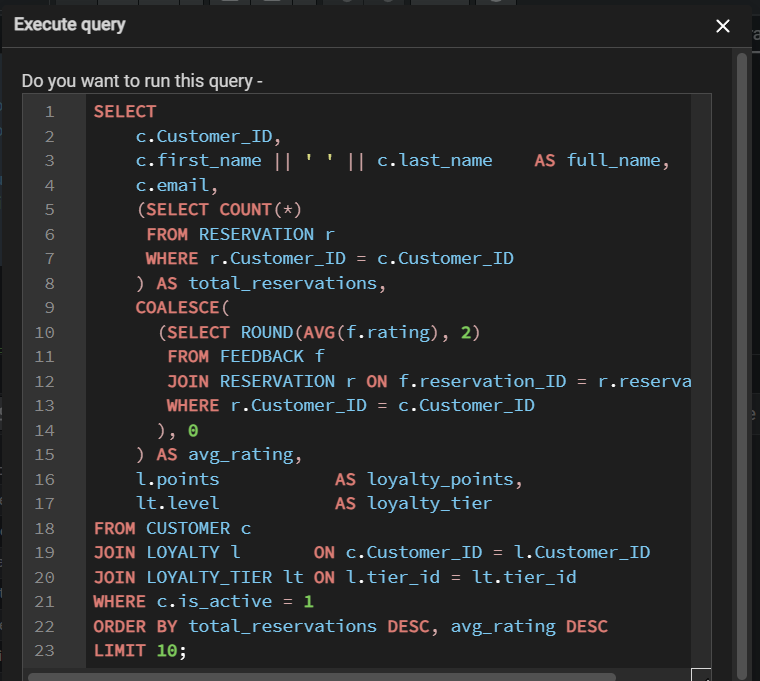

**צילום תוצאה:**

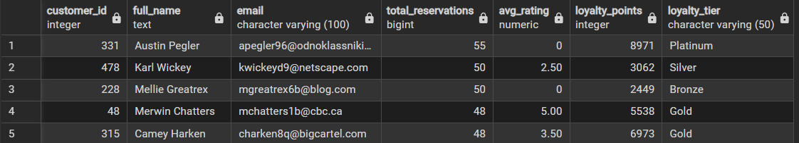

**הבדל ויעילות:**

צורה A מבצעת תוכנית ביצוע אחת שמצרפת (JOIN) את כל 5 הטבלאות בסריקה אחת, כאשר מנוע ה-DB יכול להשתמש ב-Hash Join או Merge Join. צורה B מריצה 2 שאילתות-משנה מתואמות נפרדות (ספירת הזמנות + ממוצע דירוג) עבור **כל שורת לקוח** — עם 500 לקוחות, זה עשוי לגרום ל-~1000 סריקות נוספות. **צורה A יעילה יותר** כי היא נמנעת מסריקות חוזרות.

---

### S3 — רשימת המתנה פעילה עם פרטי לקוח

**תיאור:** שאילתא זו מפעילה את מסך ניהול רשימת ההמתנה ומציגה לקוחות ברשימת ההמתנה שהם גם בעלי חשבון נאמנות, ממוינים לפי זמן הבקשה. מוצגים: מיקום, שם לקוח, גודל קבוצה, זמן כניסה, זמן המתנה משוער, סטטוס, ורמת נאמנות.

**צורה A — שימוש ב-IN (קריאה טובה יותר):**

```sql
SELECT
    w.waitlist_ID                        AS position,
    c.first_name || ' ' || c.last_name   AS customer_name,
    w.party_size,
    w.request_time                       AS time_joined,
    w.est_wait_time                      AS est_wait_min,
    st.description                       AS status,
    COALESCE(lt.level, 'No Loyalty')     AS loyalty_tier
FROM WAITLIST w
JOIN CUSTOMER c    ON w.Customer_ID = c.Customer_ID
JOIN STATUS_TYPE st ON w.status_ID = st.status_ID
LEFT JOIN LOYALTY l  ON c.Customer_ID = l.Customer_ID
LEFT JOIN LOYALTY_TIER lt ON l.tier_id = lt.tier_id
WHERE w.Customer_ID IN (
    SELECT Customer_ID FROM CUSTOMER WHERE is_active = 1
)
AND EXTRACT(YEAR FROM w.request_time) >= 2024
ORDER BY w.request_time ASC;
```

**צילום הרצה:**

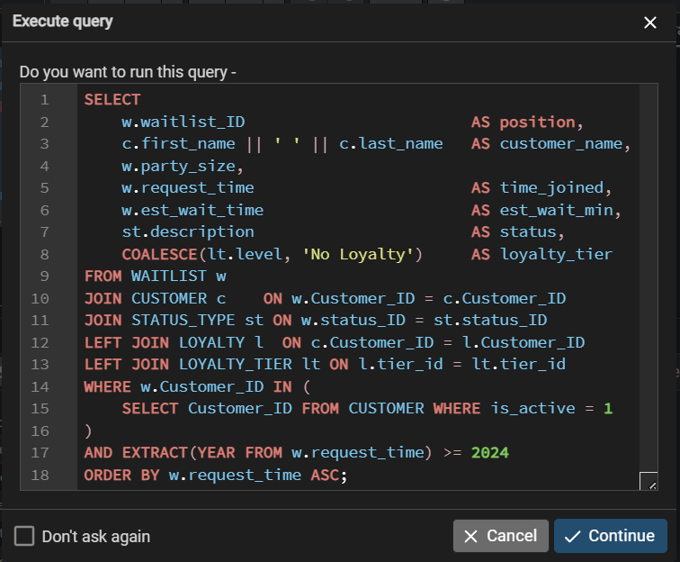

**צילום תוצאה:**

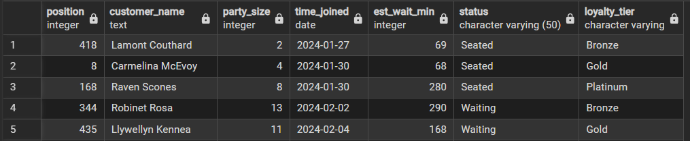

---

**צורה B — שימוש ב-EXISTS (יעילה יותר למאגרים גדולים):**

```sql
SELECT
    w.waitlist_ID                        AS position,
    c.first_name || ' ' || c.last_name   AS customer_name,
    w.party_size,
    w.request_time                       AS time_joined,
    w.est_wait_time                      AS est_wait_min,
    st.description                       AS status,
    COALESCE(lt.level, 'No Loyalty')     AS loyalty_tier
FROM WAITLIST w
JOIN CUSTOMER c    ON w.Customer_ID = c.Customer_ID
JOIN STATUS_TYPE st ON w.status_ID = st.status_ID
LEFT JOIN LOYALTY l  ON c.Customer_ID = l.Customer_ID
LEFT JOIN LOYALTY_TIER lt ON l.tier_id = lt.tier_id
WHERE EXISTS (
    SELECT 1 FROM CUSTOMER c2
    WHERE c2.Customer_ID = w.Customer_ID AND c2.is_active = 1
)
AND EXTRACT(YEAR FROM w.request_time) >= 2024
ORDER BY w.request_time ASC;
```

**צילום הרצה:**

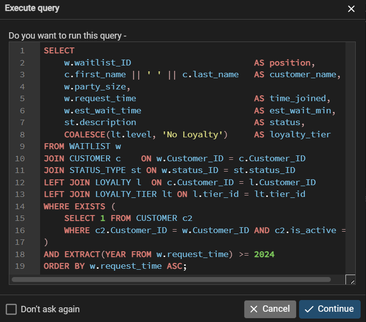

**צילום תוצאה:**

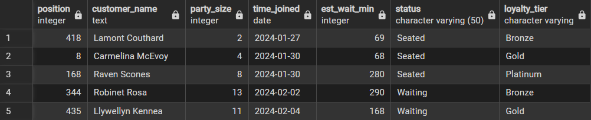

**הבדל ויעילות:**

צורה A משתמשת ב-IN אשר ממש את רשימת ה-Customer_ID הפעילים ורק אז מסננת. צורה B משתמשת ב-EXISTS שפועלת לפי עקרון "קצר-רשת" (Short-Circuit) — היא מפסיקה לסרוק את השאילתה הפנימית ברגע שמוצאת התאמה ראשונה לשורה הנוכחית, בעוד ש-IN חייבת לממש את כל תוצאות השאילתה הפנימית. **צורה B (EXISTS) יעילה יותר** כאשר הטבלה הפנימית גדולה, כי היא לא צריכה לבנות רשימה מלאה בזיכרון.

---

### S4 — פעילות נקודות נאמנות לפי סיבה ורבעון

**תיאור:** שאילתא זו מפרקת את עסקאות נקודות הנאמנות לפי סיבת עסקה ורבעון קלנדרי, ומציגה סיכומים וספירות. השאילתא מפעילה את הפאנל "עסקאות אחרונות" במסך הנאמנות. כוללת פילוח לפי שנה ורבעון עם EXTRACT.

**צורה A — JOIN עם GROUP BY (יעילה יותר):**

```sql
SELECT
    EXTRACT(YEAR FROM lt.created_at)      AS transaction_year,
    EXTRACT(QUARTER FROM lt.created_at)   AS transaction_quarter,
    rn.description                        AS reason,
    COUNT(*)                              AS transaction_count,
    SUM(lt.points_change)                 AS total_points,
    ROUND(AVG(lt.points_change), 1)       AS avg_points_per_txn
FROM LOYALTY_TRANSACTION lt
JOIN REASON rn  ON lt.reason_id = rn.reason_id
JOIN LOYALTY l  ON lt.loyalty_ID = l.loyalty_ID
GROUP BY
    EXTRACT(YEAR FROM lt.created_at),
    EXTRACT(QUARTER FROM lt.created_at),
    rn.description
HAVING COUNT(*) > 5
ORDER BY transaction_year DESC, transaction_quarter DESC, total_points DESC;
```

**צילום הרצה:**

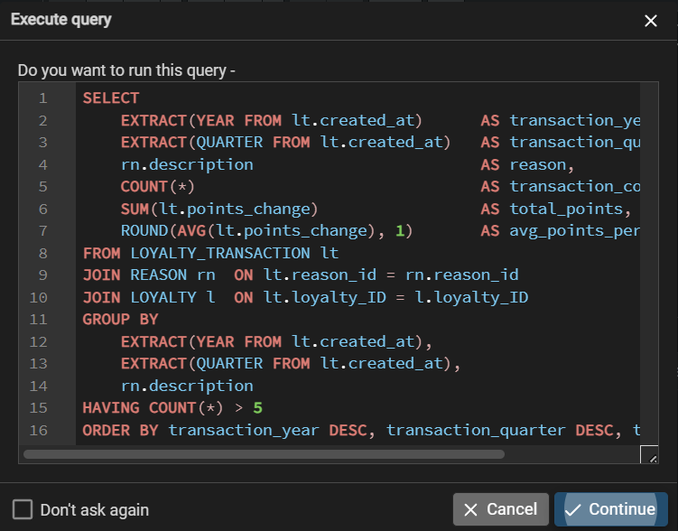

**צילום תוצאה:**

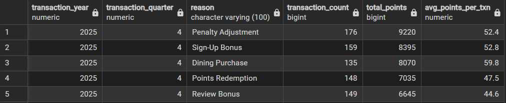

---

**צורה B — שאילתת-משנה מקוננת עם WHERE IN (פחות יעילה):**

```sql
SELECT
    EXTRACT(YEAR FROM lt.created_at)      AS transaction_year,
    EXTRACT(QUARTER FROM lt.created_at)   AS transaction_quarter,
    (SELECT rn.description FROM REASON rn WHERE rn.reason_id = lt.reason_id) AS reason,
    COUNT(*)                              AS transaction_count,
    SUM(lt.points_change)                 AS total_points,
    ROUND(AVG(lt.points_change), 1)       AS avg_points_per_txn
FROM LOYALTY_TRANSACTION lt
WHERE lt.reason_id IN (
    SELECT reason_id FROM REASON
)
GROUP BY
    EXTRACT(YEAR FROM lt.created_at),
    EXTRACT(QUARTER FROM lt.created_at),
    lt.reason_id
HAVING COUNT(*) > 5
ORDER BY transaction_year DESC, transaction_quarter DESC, total_points DESC;
```

**צילום הרצה:**

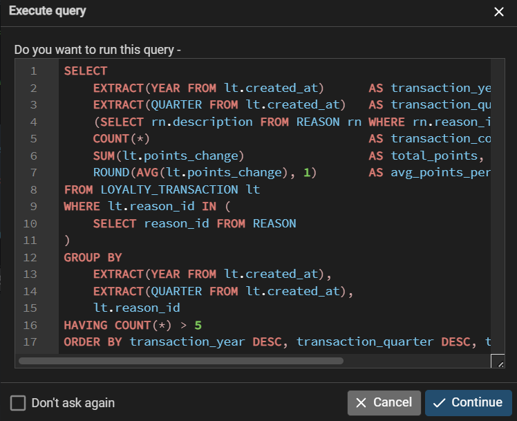

**צילום תוצאה:**

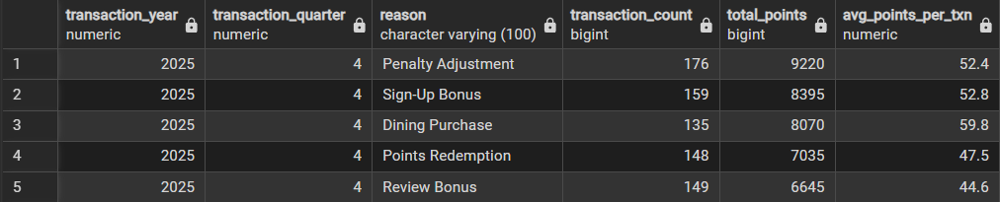

**הבדל ויעילות:**

צורה A מבצעת סריקה אחת של LOYALTY_TRANSACTION עם JOIN ל-REASON ול-LOYALTY, כאשר ה-DB מקבץ ומאגרג במעבר יחיד. צורה B מסננת תחילה את LOYALTY_TRANSACTION לפי שם סיבה (שדורש JOIN ל-REASON), ואז השאילתה החיצונית סורקת שוב ומאגרגת. בנוסף, שאילתת-המשנה ב-SELECT (`SELECT rn.description...`) מורצת עבור כל שורת תוצאה. גישה דו-שלבית זו איטית יותר מהמעבר היחיד של צורה A. **צורה A יעילה יותר.**

---

## שלב ב — שאילתות SELECT נוספות (S5–S8)

---

### S5 — דירוג משוב ממוצע לפי יום בשבוע

**תיאור:** שאילתא זו מציגה אילו ימים בשבוע מקבלים את הדירוגים הטובים והגרועים ביותר מלקוחות, ומסייעת לייעל את כוח האדם ואיכות השירות. כוללת: ספירת ביקורות, דירוג ממוצע, דירוג נמוך/גבוה ביותר, וספירת ביקורות חיוביות ושליליות.

```sql
SELECT
    CASE EXTRACT(DOW FROM r.datetime)
        WHEN 0 THEN 'Sunday'
        WHEN 1 THEN 'Monday'
        WHEN 2 THEN 'Tuesday'
        WHEN 3 THEN 'Wednesday'
        WHEN 4 THEN 'Thursday'
        WHEN 5 THEN 'Friday'
        WHEN 6 THEN 'Saturday'
    END                                   AS day_of_week,
    COUNT(f.feedback_ID)                  AS total_reviews,
    ROUND(AVG(f.rating), 2)              AS avg_rating,
    MIN(f.rating)                         AS lowest_rating,
    MAX(f.rating)                         AS highest_rating,
    COUNT(CASE WHEN f.rating >= 4 THEN 1 END) AS positive_reviews,
    COUNT(CASE WHEN f.rating <= 2 THEN 1 END) AS negative_reviews
FROM FEEDBACK f
JOIN RESERVATION r ON f.reservation_ID = r.reservation_ID
JOIN CUSTOMER c    ON r.Customer_ID = c.Customer_ID
GROUP BY EXTRACT(DOW FROM r.datetime)
ORDER BY avg_rating DESC;
```

**צילום הרצה:**

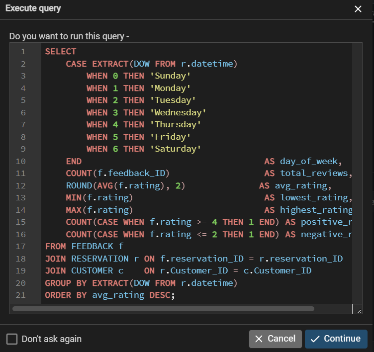

**צילום תוצאה:**

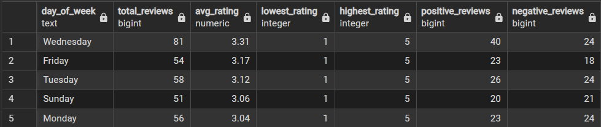

---

### S6 — הזמנות שהושלמו ללא משוב

**תיאור:** שאילתא זו מזהה הזמנות שהושלמו אך טרם הוזן להן משוב, כדי שצוות המסעדה יוכל לשלוח מיילי בקשה לביקורת. משתמשת ב-LEFT JOIN עם IS NULL לאיתור רשומות חסרות.

```sql
SELECT
    r.reservation_ID,
    c.first_name || ' ' || c.last_name    AS customer_name,
    c.email,
    r.datetime                            AS reservation_date,
    EXTRACT(MONTH FROM r.datetime)        AS reservation_month,
    EXTRACT(YEAR FROM r.datetime)         AS reservation_year,
    r.party_size,
    st.description                        AS status
FROM RESERVATION r
JOIN CUSTOMER c     ON r.Customer_ID = c.Customer_ID
JOIN STATUS_TYPE st ON r.status_ID = st.status_ID
LEFT JOIN FEEDBACK f ON r.reservation_ID = f.reservation_ID
WHERE f.feedback_ID IS NULL
  AND st.description = 'Completed'
ORDER BY r.datetime DESC
LIMIT 50;
```

**צילום הרצה:**

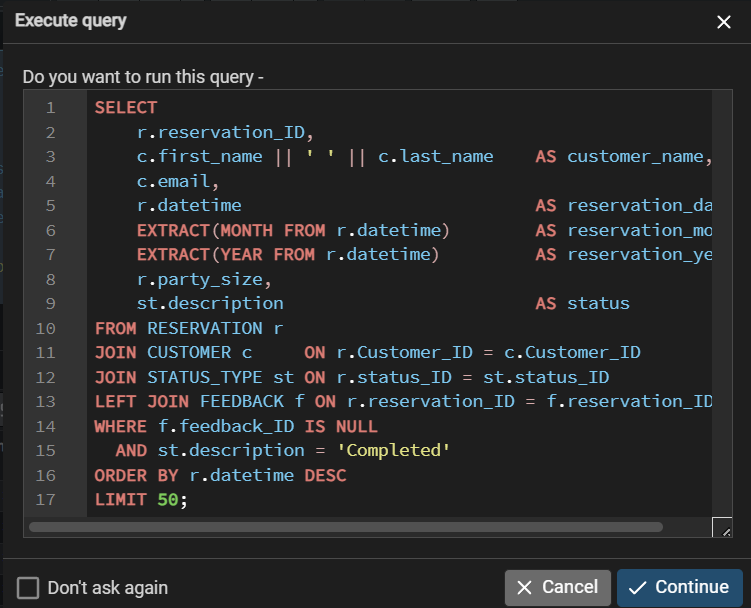

**צילום תוצאה:**

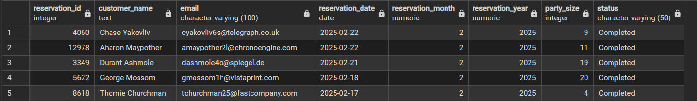

---

### S7 — פרופיל לקוח מלא עם עסקאות נאמנות

**תיאור:** עבור לקוח נתון (Customer_ID = 1), השאילתא מציגה את עסקאות הנאמנות האחרונות שלו כולל: סיבה, פירוט תאריך (יום, חודש, שנה), נקודות נוכחיות, רמה נוכחית, ומרחק בנקודות לרמה הבאה. השאילתא מפעילה את רשימת "העסקאות האחרונות" במסך הנאמנות.

```sql
SELECT
    c.first_name || ' ' || c.last_name              AS customer_name,
    lt_tier.level                                    AS current_tier,
    l.points                                         AS current_points,
    CASE
        WHEN lt_tier.level = 'Bronze'   THEN 2501 - l.points
        WHEN lt_tier.level = 'Silver'   THEN 5001 - l.points
        WHEN lt_tier.level = 'Gold'     THEN 7501 - l.points
        WHEN lt_tier.level = 'Platinum' THEN 0
    END                                              AS points_to_next_tier,
    rn.description                                   AS transaction_reason,
    lt_txn.points_change,
    EXTRACT(DAY FROM lt_txn.created_at)              AS txn_day,
    EXTRACT(MONTH FROM lt_txn.created_at)            AS txn_month,
    EXTRACT(YEAR FROM lt_txn.created_at)             AS txn_year
FROM CUSTOMER c
JOIN LOYALTY l           ON c.Customer_ID = l.Customer_ID
JOIN LOYALTY_TIER lt_tier ON l.tier_id = lt_tier.tier_id
JOIN LOYALTY_TRANSACTION lt_txn ON l.loyalty_ID = lt_txn.loyalty_ID
JOIN REASON rn           ON lt_txn.reason_id = rn.reason_id
WHERE c.Customer_ID = 1
ORDER BY lt_txn.created_at DESC
LIMIT 20;
```

**צילום הרצה:**

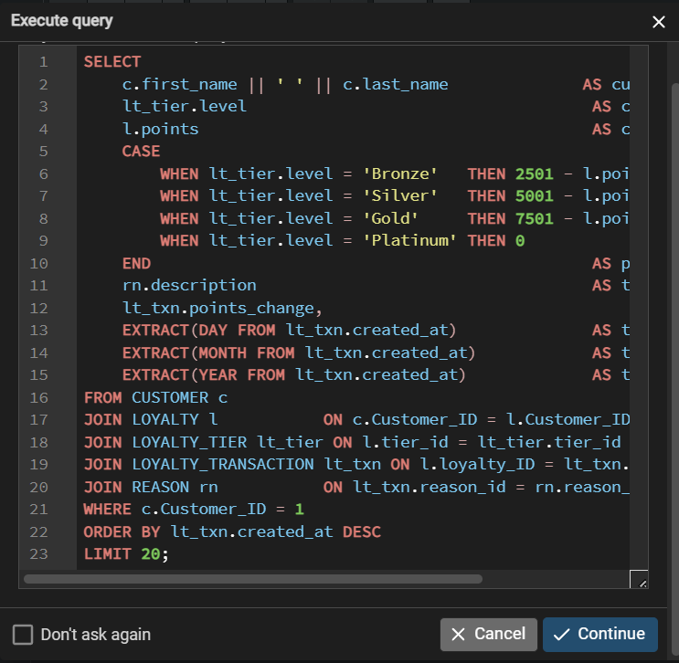

**צילום תוצאה:**

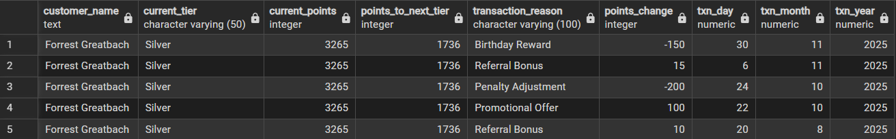

---

### S8 — דירוג החודשים העמוסים ביותר (מגמות עונתיות)

**תיאור:** השאילתא מדרגת חודשים לפי סך האורחים שהתארחו לאורך כל השנים, וחושפת דפוסים עונתיים לצורך תכנון קיבולת. השאילתא משתמשת בפונקציית חלון RANK() לדירוג חודשים בתוך כל שנה.

```sql
SELECT
    EXTRACT(YEAR FROM r.datetime)            AS res_year,
    EXTRACT(MONTH FROM r.datetime)           AS res_month,
    COUNT(r.reservation_ID)                  AS total_reservations,
    SUM(r.party_size)                        AS total_guests,
    ROUND(AVG(r.party_size), 1)              AS avg_party_size,
    RANK() OVER (
        PARTITION BY EXTRACT(YEAR FROM r.datetime)
        ORDER BY SUM(r.party_size) DESC
    )                                        AS month_rank_by_guests
FROM RESERVATION r
JOIN STATUS_TYPE st ON r.status_ID = st.status_ID
WHERE st.description IN ('Confirmed', 'Completed')
GROUP BY
    EXTRACT(YEAR FROM r.datetime),
    EXTRACT(MONTH FROM r.datetime)
ORDER BY res_year DESC, month_rank_by_guests ASC;
```

**צילום הרצה:**

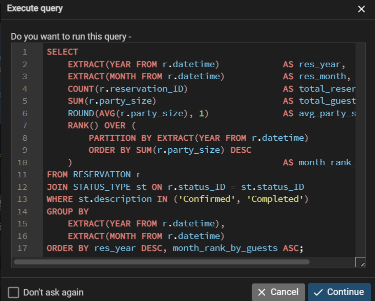

**צילום תוצאה:**

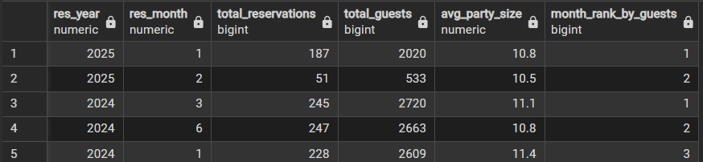

---

## שלב ב — שאילתות DELETE

---

### D1 — מחיקת רשומות רשימת המתנה שפגו תוקף (מעל שנה)

**תיאור:** מחיקת רשומות רשימת המתנה בסטטוס 'Expired' שישנות מעל שנה. שומרת על טבלת רשימת ההמתנה רזה ויעילה.

```sql
DELETE FROM WAITLIST
WHERE status_ID = (SELECT status_ID FROM STATUS_TYPE WHERE description = 'Expired')
  AND request_time < CURRENT_DATE - INTERVAL '1 year';
```

**צילום מסד הנתונים לפני המחיקה:**

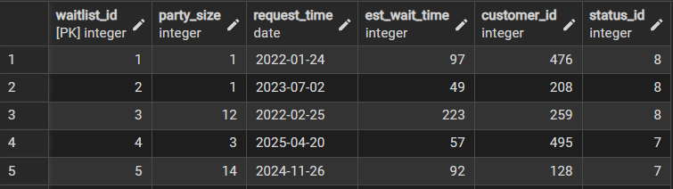

**צילום הרצה:**

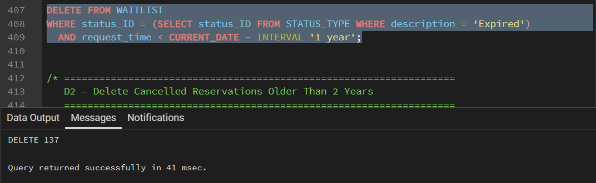

**צילום מסד הנתונים אחרי המחיקה:**

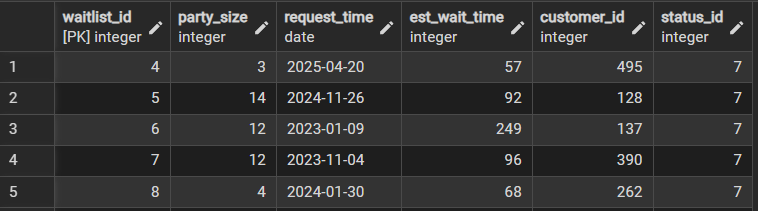

---

### D2 — מחיקת הזמנות שבוטלו לפני יותר משנתיים

**תיאור:** תחילה מוחקת משוב המקושר להזמנות שבוטלו לפני מעל שנתיים, ואז מוחקת את ההזמנות עצמן. מכבדת אילוצי Foreign Key על ידי מחיקת רשומות ילד תחילה.

```sql
-- שלב 1: מחיקת משוב המקושר להזמנות ישנות שבוטלו
DELETE FROM FEEDBACK
WHERE reservation_ID IN (
    SELECT r.reservation_ID
    FROM RESERVATION r
    JOIN STATUS_TYPE st ON r.status_ID = st.status_ID
    WHERE st.description = 'Cancelled'
      AND r.datetime < CURRENT_DATE - INTERVAL '2 years'
);

-- שלב 2: מחיקת ההזמנות הישנות שבוטלו עצמן
DELETE FROM RESERVATION
WHERE status_ID = (SELECT status_ID FROM STATUS_TYPE WHERE description = 'Cancelled')
  AND datetime < CURRENT_DATE - INTERVAL '2 years';
```

**צילום מסד הנתונים לפני המחיקה:**

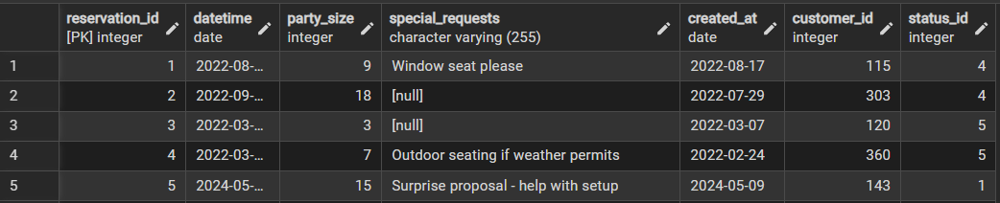

**צילום הרצה:**

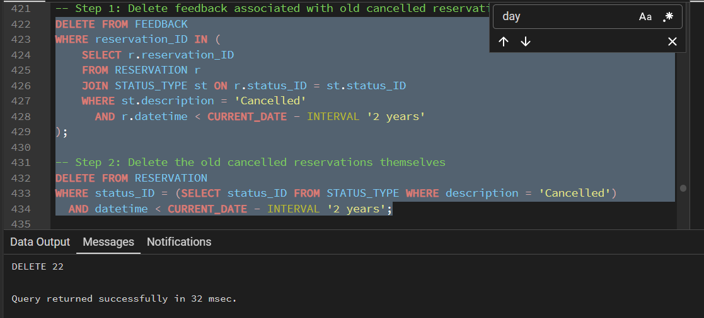

**צילום מסד הנתונים אחרי המחיקה:**

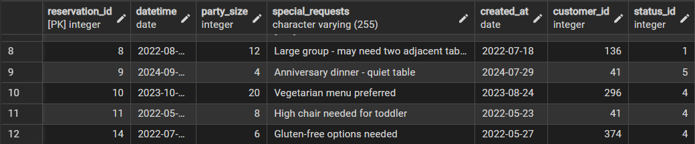

---

### D3 — מחיקת עסקאות נאמנות ללקוחות מושבתים עם אפס נקודות

**תיאור:** מסירה רשומות עסקאות נאמנות עבור לקוחות שהושבתו (is_active = 0) ויש להם אפס נקודות. רשומות אלו אינן רלוונטיות עוד לפעולה.

```sql
DELETE FROM LOYALTY_TRANSACTION
WHERE loyalty_ID IN (
    SELECT l.loyalty_ID
    FROM LOYALTY l
    JOIN CUSTOMER c ON l.Customer_ID = c.Customer_ID
    WHERE c.is_active = 0
      AND l.points = 0
);
```

**צילום מסד הנתונים לפני המחיקה:**

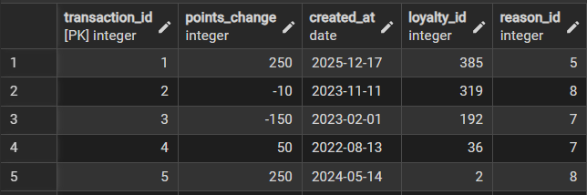

**צילום הרצה:**

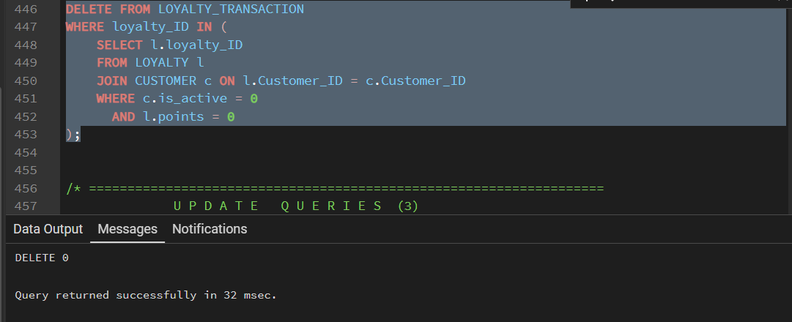

**צילום מסד הנתונים אחרי המחיקה:**


---

## שלב ב — שאילתות UPDATE

---

### U1 — שדרוג אוטומטי של רמת נאמנות לפי נקודות

**תיאור:** מעדכנת אוטומטית את רמת הנאמנות של כל לקוח בהתאם ליתרת הנקודות שלו: Bronze (0–2500), Silver (2501–5000), Gold (5001–7500), Platinum (7501+).

```sql
UPDATE LOYALTY
SET tier_id = CASE
    WHEN points <= 2500 THEN (SELECT tier_id FROM LOYALTY_TIER WHERE level = 'Bronze')
    WHEN points <= 5000 THEN (SELECT tier_id FROM LOYALTY_TIER WHERE level = 'Silver')
    WHEN points <= 7500 THEN (SELECT tier_id FROM LOYALTY_TIER WHERE level = 'Gold')
    ELSE                     (SELECT tier_id FROM LOYALTY_TIER WHERE level = 'Platinum')
END,
last_Updated = CURRENT_DATE;
```

**צילום מסד הנתונים לפני העדכון:**

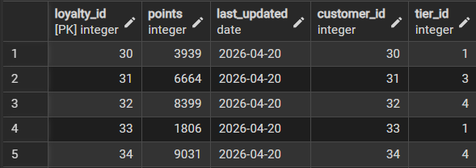

**צילום הרצה:**

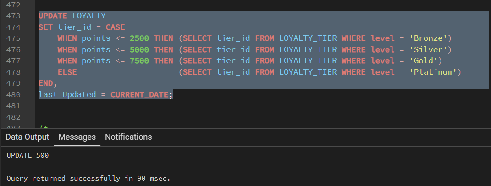

**צילום מסד הנתונים אחרי העדכון:**

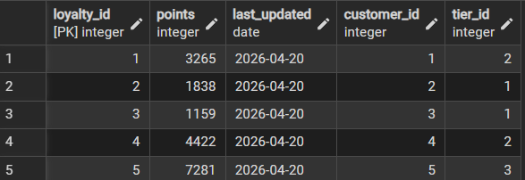

---

### U2 — סימון הזמנות שאושרו בעבר כ-Completed

**תיאור:** מעדכנת אוטומטית הזמנות שתאריכן כבר עבר ועדיין מסומנות 'Confirmed' לסטטוס 'Completed'.

```sql
UPDATE RESERVATION
SET status_ID = (SELECT status_ID FROM STATUS_TYPE WHERE description = 'Completed')
WHERE datetime < CURRENT_DATE
  AND status_ID = (SELECT status_ID FROM STATUS_TYPE WHERE description = 'Confirmed');
```

**צילום מסד הנתונים לפני העדכון:**

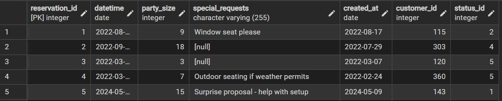

**צילום הרצה:**

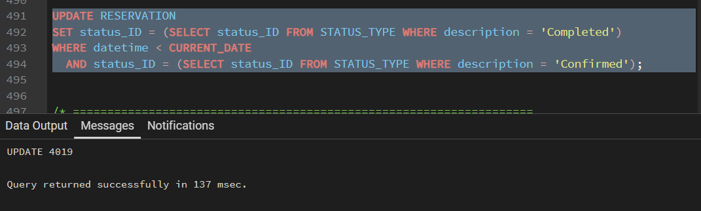

**צילום מסד הנתונים אחרי העדכון:**

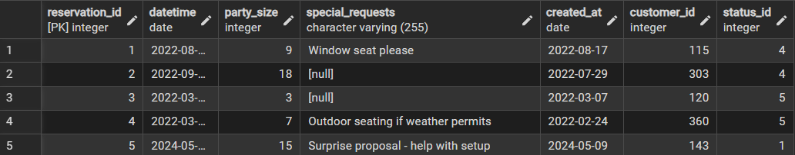

---

### U3 — השבתת לקוחות לא פעילים (ללא הזמנה מעל שנתיים)

**תיאור:** מגדירה is_active = 0 ללקוחות שלא ביצעו הזמנה מעל שנתיים. משתמשת בשאילתת-משנה NOT EXISTS לבדיקת פעילות אחרונה.

```sql
UPDATE CUSTOMER
SET is_active = 0
WHERE is_active = 1
  AND NOT EXISTS (
    SELECT 1
    FROM RESERVATION r
    WHERE r.Customer_ID = CUSTOMER.Customer_ID
      AND r.datetime >= CURRENT_DATE - INTERVAL '2 years'
  );
```

**צילום מסד הנתונים לפני העדכון:**

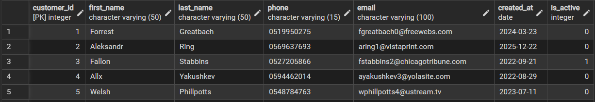

**צילום הרצה:**

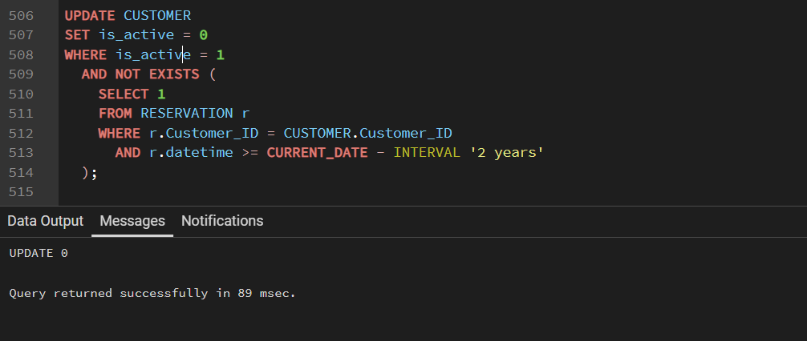

**צילום מסד הנתונים אחרי העדכון:**


---

## שלב ב — אילוצים (Constraints)

---

### אילוץ 1 — תאריך הזמנה חייב להיות לאחר תאריך היצירה

**תיאור השינוי:** הוספת אילוץ CHECK על טבלת RESERVATION המבטיח שהתאריך המתוכנן לסעודה (datetime) חייב להיות שווה או מאוחר יותר מתאריך יצירת ההזמנה (created_at). זה מונע יצירת הזמנות לתאריכים שכבר עברו יחסית לרגע היצירה.

```sql
ALTER TABLE RESERVATION
ADD CONSTRAINT chk_reservation_future_date
CHECK (datetime >= created_at);
```

**ניסיון הכנסת נתונים סותרים (ושגיאת הרצה):**

```sql
-- ניסיון ליצור הזמנה עם datetime לפני created_at — צפוי להיכשל
INSERT INTO RESERVATION (reservation_ID, Customer_ID, status_ID, party_size, datetime, created_at)
VALUES (99999, 1, 1, 4, '2023-01-01 12:00:00', '2025-06-01 10:00:00');
```

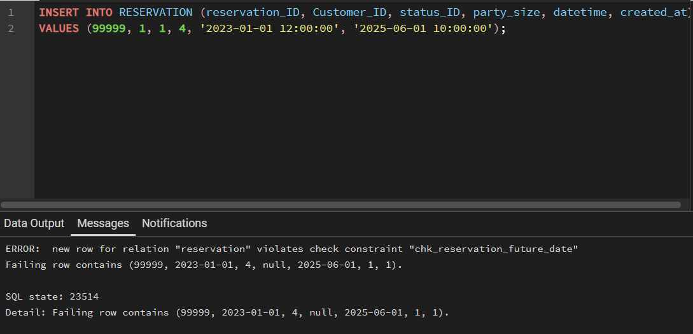

---

### אילוץ 2 — תגובת משוב חייבת להיות בעלת משמעות (לפחות 4 תווים)

**תיאור השינוי:** הוספת אילוץ CHECK על טבלת FEEDBACK המבטיח שאם לקוח משאיר תגובה, היא חייבת להכיל לפחות 4 תווים (לאחר חיתוך רווחים). תגובות כמו "Ok", "No" או שגיאות הקלדה של אות אחת נדחות. ערך NULL מותר (הלקוח לא חייב להשאיר תגובה).

```sql
ALTER TABLE FEEDBACK
ADD CONSTRAINT chk_meaningful_comment
CHECK (comment IS NULL OR LENGTH(TRIM(comment)) >= 4);
```

**ניסיון הכנסת נתונים סותרים (ושגיאת הרצה):**

```sql
-- ניסיון להכניס משוב עם תגובה קצרה מדי — צפוי להיכשל
INSERT INTO FEEDBACK (feedback_ID, reservation_ID, rating, comment, feedback_date)
VALUES (99999, 1, 5, 'Ok', CURRENT_DATE);
```

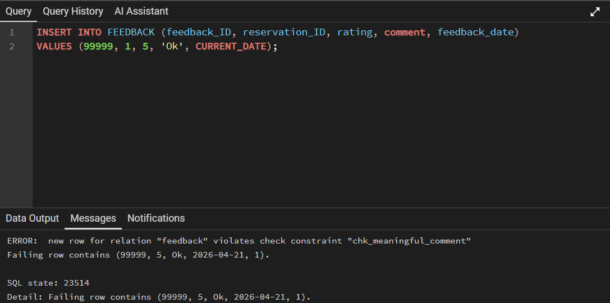

---

### אילוץ 3 — שם פרטי ושם משפחה לא יכולים להיות זהים

**תיאור השינוי:** הוספת אילוץ CHECK על טבלת CUSTOMER המבטיח ששם פרטי ושם משפחה של לקוח לא יהיו זהים (בהשוואה case-insensitive). מצב כזה מעיד בדרך כלל על שגיאת הזנת נתונים (למשל "John John").

```sql
ALTER TABLE CUSTOMER
ADD CONSTRAINT chk_names_different
CHECK (LOWER(first_name) <> LOWER(last_name));
```

**ניסיון הכנסת נתונים סותרים (ושגיאת הרצה):**

```sql
-- ניסיון להכניס לקוח עם שם פרטי ומשפחה זהים — צפוי להיכשל
INSERT INTO CUSTOMER (Customer_ID, first_name, last_name, phone, email, created_at, is_active)
VALUES (99999, 'John', 'John', '0501234567', 'john@example.com', CURRENT_DATE, 1);
```

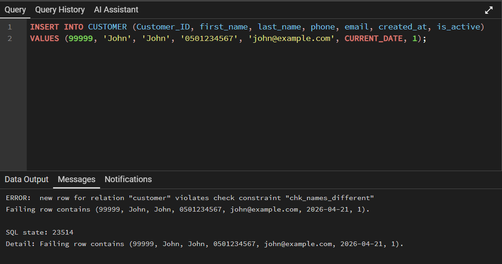

---

## שלב ב — Rollback ו-Commit

---

### דוגמה 1: ROLLBACK — עדכון נקודות נאמנות וביטול השינוי

**תרחיש:** מנהל מוסיף בטעות 9999 נקודות לחשבון הנאמנות של לקוח 1. נציג את השינוי, ואז נבצע ROLLBACK לביטולו.

**שלב 1 — מצב BEFORE (לפני השינוי):**

```sql
SELECT c.first_name || ' ' || c.last_name AS customer_name, l.points, lt.level AS tier
FROM CUSTOMER c
JOIN LOYALTY l       ON c.Customer_ID = l.Customer_ID
JOIN LOYALTY_TIER lt ON l.tier_id = lt.tier_id
WHERE c.Customer_ID = 1;
```

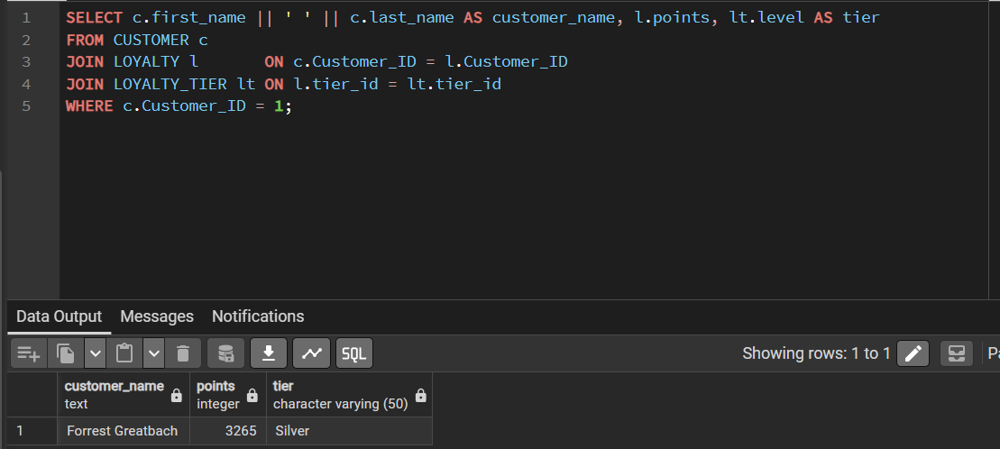


**שלב 2 — פתיחת טרנזקציה וביצוע UPDATE:**

```sql
BEGIN;

UPDATE LOYALTY
SET points = 9999, last_Updated = CURRENT_DATE
WHERE Customer_ID = 1;
```

**שלב 3 — מצב AFTER (לאחר העדכון, לפני Rollback):**

```sql
SELECT c.first_name || ' ' || c.last_name AS customer_name, l.points, lt.level AS tier
FROM CUSTOMER c
JOIN LOYALTY l       ON c.Customer_ID = l.Customer_ID
JOIN LOYALTY_TIER lt ON l.tier_id = lt.tier_id
WHERE c.Customer_ID = 1;
```

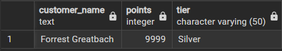

**שלב 4 — ביצוע ROLLBACK:**

```sql
ROLLBACK;
```

**שלב 5 — מצב RESTORED (לאחר הביטול):**

```sql
SELECT c.first_name || ' ' || c.last_name AS customer_name, l.points, lt.level AS tier
FROM CUSTOMER c
JOIN LOYALTY l       ON c.Customer_ID = l.Customer_ID
JOIN LOYALTY_TIER lt ON l.tier_id = lt.tier_id
WHERE c.Customer_ID = 1;
```

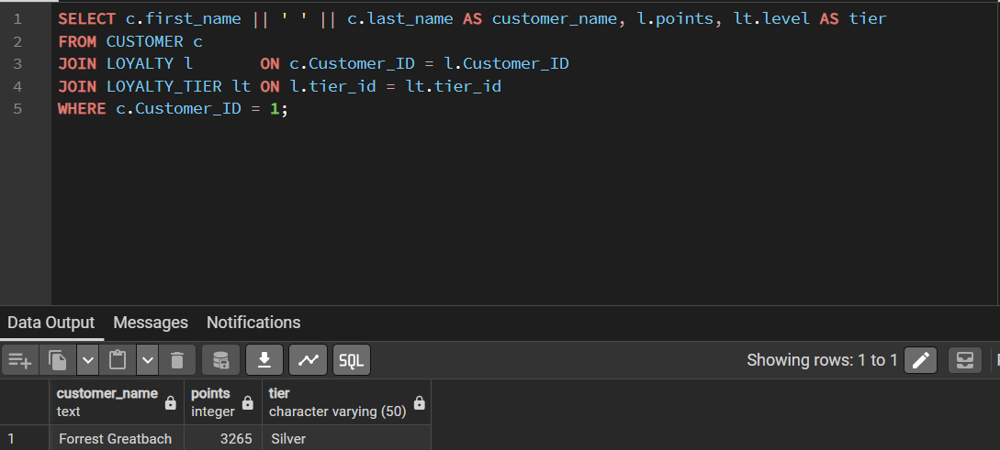

---

### דוגמה 2: COMMIT — עדכון סטטוס הזמנה ושמירת השינוי

**תרחיש:** מארח מאשר הזמנה ממתינה (ID = 1). נעדכן את הסטטוס ל-'Confirmed', נבצע COMMIT ונוודא שהשינוי נשמר.

**שלב 1 — מצב BEFORE (לפני השינוי):**

```sql
SELECT r.reservation_ID, c.first_name || ' ' || c.last_name AS customer_name,
       r.datetime, r.party_size, st.description AS status
FROM RESERVATION r
JOIN CUSTOMER c     ON r.Customer_ID = c.Customer_ID
JOIN STATUS_TYPE st ON r.status_ID = st.status_ID
WHERE r.reservation_ID = 1;
```

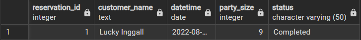

**שלב 2 — פתיחת טרנזקציה וביצוע UPDATE:**

```sql
BEGIN;


UPDATE RESERVATION
SET status_ID = (SELECT status_ID FROM STATUS_TYPE WHERE description = 'Confirmed')
WHERE reservation_ID = 1;
```

**שלב 3 — מצב AFTER (לאחר העדכון, לפני Commit):**

```sql
SELECT r.reservation_ID, c.first_name || ' ' || c.last_name AS customer_name,
       r.datetime, r.party_size, st.description AS status
FROM RESERVATION r
JOIN CUSTOMER c     ON r.Customer_ID = c.Customer_ID
JOIN STATUS_TYPE st ON r.status_ID = st.status_ID
WHERE r.reservation_ID = 1;
```

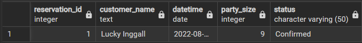

**שלב 4 — ביצוע COMMIT:**

```sql
COMMIT;
```

**שלב 5 — מצב FINAL (לאחר ה-Commit — השינוי קבוע):**

```sql
SELECT r.reservation_ID, c.first_name || ' ' || c.last_name AS customer_name,
       r.datetime, r.party_size, st.description AS status
FROM RESERVATION r
JOIN CUSTOMER c     ON r.Customer_ID = c.Customer_ID
JOIN STATUS_TYPE st ON r.status_ID = st.status_ID
WHERE r.reservation_ID = 1;
```


---

## שלב ב — אינדקסים (Indexes)

---

### אינדקס 1 — `idx_reservation_customer` על RESERVATION(Customer_ID)

**תיאור:** שאילתות SELECT רבות (S1, S2, S3, S6, S7, S8) מבצעות JOIN בין RESERVATION ל-CUSTOMER. אינדקס על Customer_ID מאיץ את חיפוש ההתאמות.

```sql
CREATE INDEX IF NOT EXISTS idx_reservation_customer
ON RESERVATION (Customer_ID);
```

**זמן ריצה לפני הוספת האינדקס:**

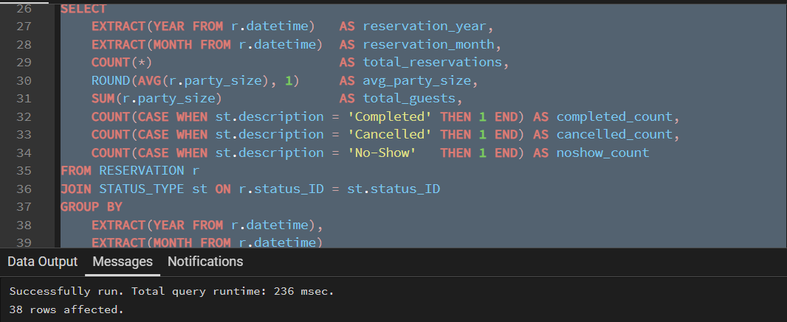

**זמן ריצה לאחר הוספת האינדקס:**

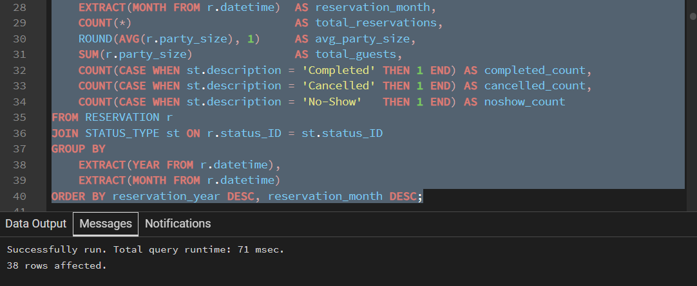

---

### אינדקס 2 — `idx_reservation_datetime` על RESERVATION(datetime)

**תיאור:** שאילתות S1, S6, S8, ו-U2 כולן מסננות או מקבצות לפי תאריך ההזמנה (datetime). אינדקס על עמודה זו משפר את ביצועי GROUP BY וסריקות טווח (range scans).

```sql
CREATE INDEX IF NOT EXISTS idx_reservation_datetime
ON RESERVATION (datetime);
```

**זמן ריצה לפני הוספת האינדקס:**

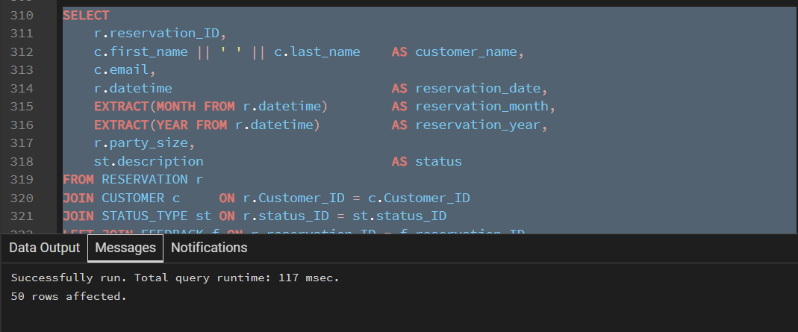

**זמן ריצה לאחר הוספת האינדקס:**

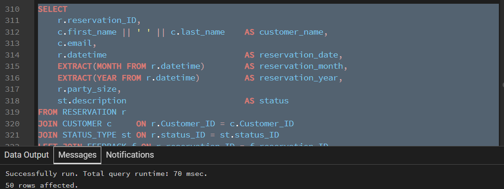

---

### אינדקס 3 — `idx_loyalty_txn_created` על LOYALTY_TRANSACTION(created_at)

**תיאור:** שאילתא S4 מקבצת לפי EXTRACT(YEAR/QUARTER) מ-created_at. אינדקס על עמודה זו מאיץ את האגרגציה מבוססת התאריך.

```sql
CREATE INDEX IF NOT EXISTS idx_loyalty_txn_created
ON LOYALTY_TRANSACTION (created_at);
```

**זמן ריצה לפני הוספת האינדקס:**

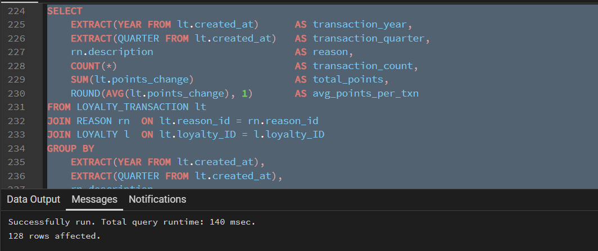

**זמן ריצה לאחר הוספת האינדקס:**

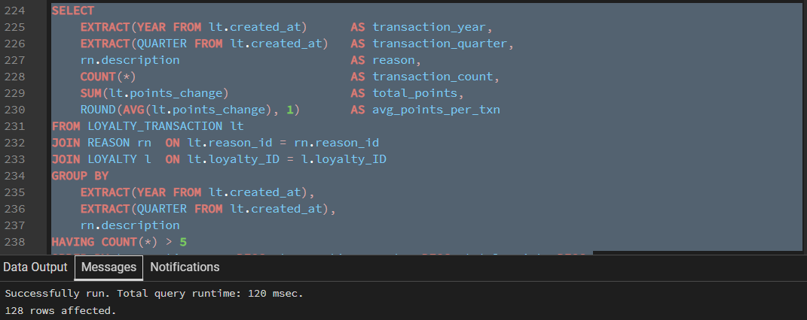

---

### הסבר תוצאות האינדקסים

האינדקסים משפיעים על ביצועים בכך שהם מאפשרים למנוע מסד הנתונים לגשת ישירות לשורות הרלוונטיות במקום לבצע **Full Table Scan** (סריקה מלאה של הטבלה). ללא אינדקס, מנוע ה-DB חייב לעבור על כל שורה בטבלה כדי למצוא התאמות. עם אינדקס, הוא משתמש במבנה נתונים מסוג **B-Tree** שמאפשר חיפוש לוגריתמי (O(log n)) במקום ליניארי (O(n)).

בפרט:
- **אינדקס על Customer_ID:** מאיץ פעולות JOIN כי ה-DB יכול לאתר את כל ההזמנות של לקוח מסוים ללא סריקת הטבלה המלאה.
- **אינדקס על datetime:** מאיץ שאילתות עם סינון טווח תאריכים ו-GROUP BY, כי הנתונים כבר ממוינים באינדקס.
- **אינדקס על created_at:** מאיץ את פירוק התאריך (EXTRACT) ב-GROUP BY, כי ה-DB יכול לסרוק את האינדקס בסדר כרונולוגי.

> **הערה:** השיפור בולט יותר ככל שהטבלה גדולה יותר. עם כ-40,000+ רשומות, ההבדל בזמני הריצה ניכר.